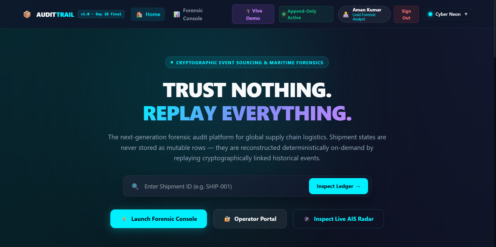
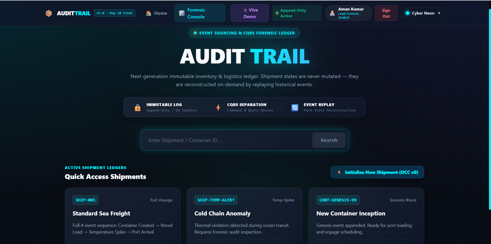
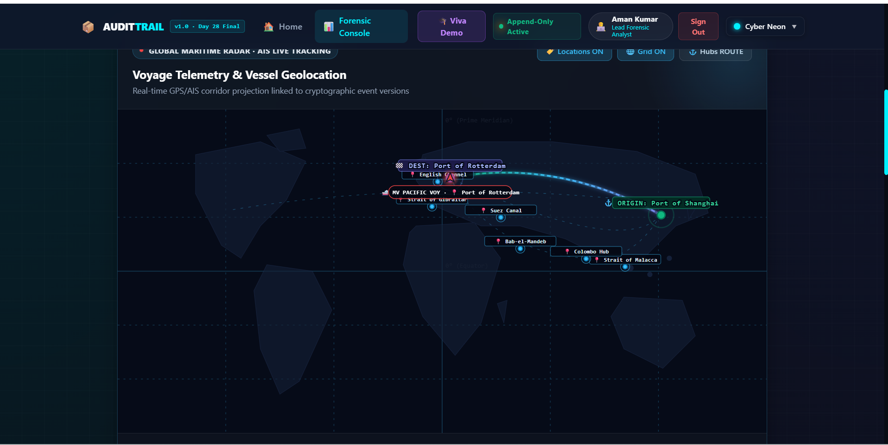
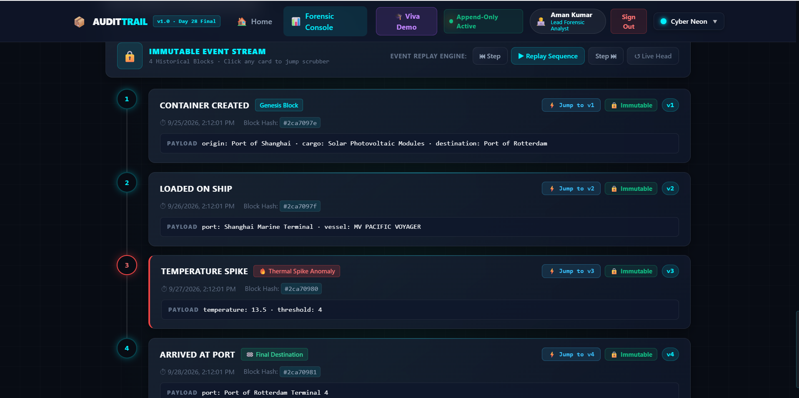
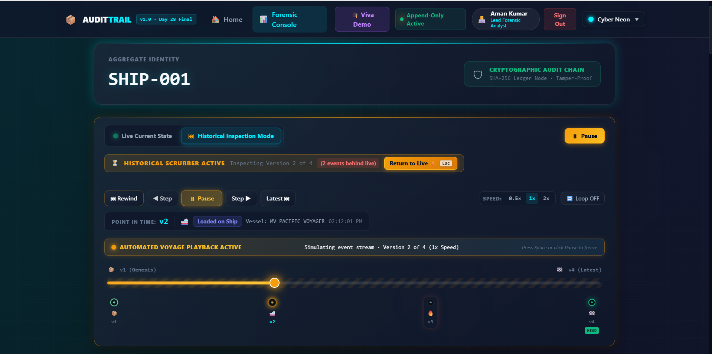
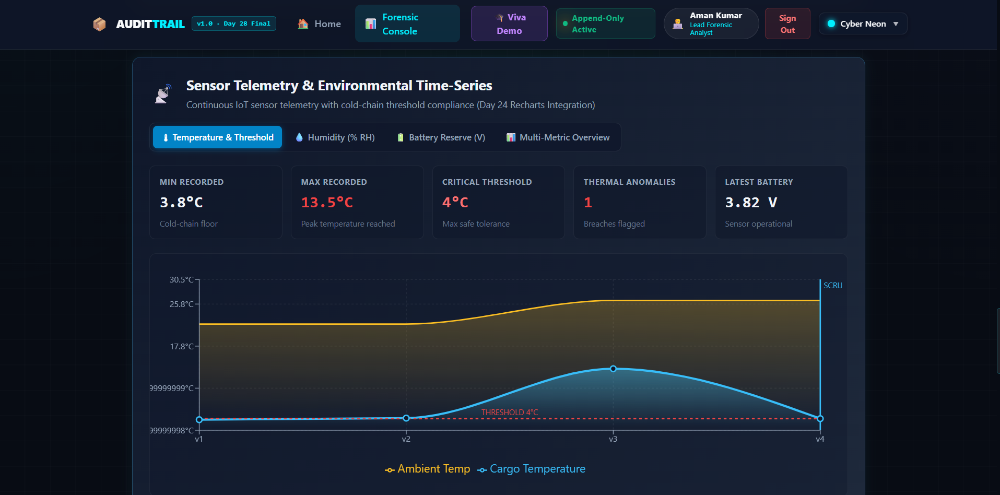
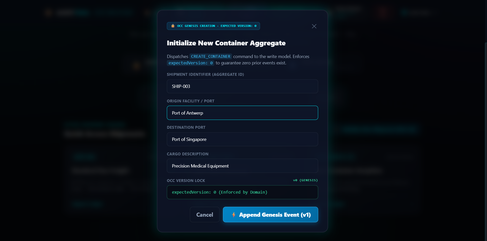
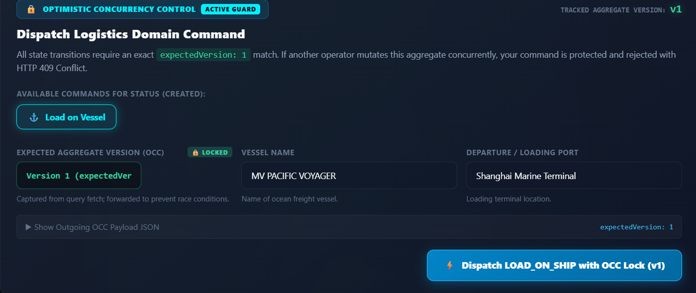
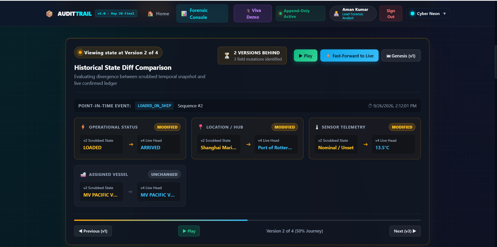
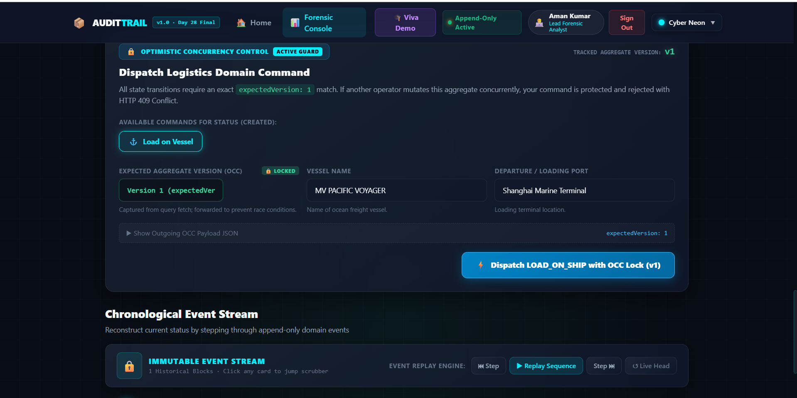

# 🚢 AUDIT TRAIL: EVENT-SOURCED INVENTORY & LOGISTICS LEDGER
## Comprehensive Project Engineering Report & Architectural Specification

**Enterprise Event-Sourced Inventory & Logistics Ledger**  
*MERN • Event Sourcing • CQRS • Optimistic Concurrency Control (OCC) • 28-Day Milestone Complete Delivery*

[](https://audit-trail-gray.vercel.app/)
[](https://audit-trail-backend.onrender.com)
[](https://github.com/Raushan1504/Audit_Trail)
[](https://github.com/Raushan1504/Audit_Trail)

---

### 🌐 Live Deployment & Project Links
- **🚀 Live Application (Frontend SPA):** [**https://audit-trail-gray.vercel.app/**](https://audit-trail-gray.vercel.app/)
- **⚡ Backend REST API:** [**https://audit-trail-backend.onrender.com/**](https://audit-trail-backend.onrender.com/)
- **🩺 API Health Check:** [**https://audit-trail-backend.onrender.com/health**](https://audit-trail-backend.onrender.com/health)
- **🎓 Forensic Walkthrough & Case Study:** [**Forensic Case Study Guide**](docs/FORENSIC_CASE_STUDY_DEMO.md)

---

### Project Metadata & Evaluation Summary

| Parameter | Details |
|---|---|
| **Project Title** | **Audit Trail: Event-Sourced Cold-Chain & Logistics Ledger** |
| **System Classification** | Enterprise MERN Stack Distributed Ledger with Temporal Replay & CQRS |
| **Project Duration** | 28 Calendar Days (4 Engineering Phases • 84 Monitored Commits) |
| **Core Architecture** | Append-Only Event Store • CQRS • Deterministic Replay Engine • Read Model Projections • OCC Concurrency Protection |
| **Frontend Deployment** | [https://audit-trail-gray.vercel.app](https://audit-trail-gray.vercel.app) *(Vercel SPA)* |
| **Backend API Deployment** | [https://audit-trail-backend.onrender.com](https://audit-trail-backend.onrender.com) *(Render Web Service)* |
| **Repository URL** | [https://github.com/Raushan1504/Audit_Trail](https://github.com/Raushan1504/Audit_Trail) |
| **Target SLA** | Sub-10ms Read Model Queries ($\mathcal{O}(1)$) • 100% Immutability Guarantee • Zero Silent Overwrites |

| Phase | Duration | Scope | Status |
|---|---|---|---|
| **Phase 1: Weeks 1 & 2** | Days 1 – 14 | Foundation, CQRS, MongoDB Event Store, React Timeline, Immutability Audit, State Reconstruction | **COMPLETED & VERIFIED** ✅ |
| **Mid-Project Review** | Day 14 | Proof of Event Store Immutability (`APPEND/READ` only, `UPDATE/DELETE` rejected) + Historical Event Replay State Reconstruction | **OFFICIALLY PASSED** ✅ |
| **Phase 2: Week 3** | Days 15 – 21 | High-Performance Read Models (Projections), Background Worker, React Time-Scrubbing Slider | **COMPLETED & VERIFIED** ✅ |
| **Phase 3: Week 4** | Days 22 – 28 | Optimistic Concurrency Control (OCC), Recharts Sensor Telemetry, Production Deployment & Final Review | **COMPLETED & DELIVERED** ✅ |

---

## 📑 Table of Contents
1. [Executive Summary & Problem Statement](#1-executive-summary--problem-statement)
2. [🎥 Project Video Demonstration](#2--project-video-demonstration)
3. [📸 Visual System Walkthrough & Screenshot Gallery](#3--visual-system-walkthrough--screenshot-gallery)
4. [Advanced System Architecture](#4-advanced-system-architecture)
   - 4.1 [End-to-End CQRS & Event Sourcing Topology](#41-end-to-end-cqrs--event-sourcing-topology)
   - 4.2 [Append-Only Event Store & Immutability Enforcement](#42-append-only-event-store--immutability-enforcement)
   - 4.3 [Deterministic Point-in-Time State Reconstruction Engine](#43-deterministic-point-in-time-state-reconstruction-engine)
   - 4.4 [Asynchronous Background Projection Worker](#44-asynchronous-background-projection-worker)
   - 4.5 [Optimistic Concurrency Control (OCC)](#45-optimistic-concurrency-control-occ)
5. [Forensic Case Study: Cold-Chain Spoilage Investigation](#5-forensic-case-study-cold-chain-spoilage-investigation)
6. [Empirical Performance Benchmarks](#6-empirical-performance-benchmarks)
7. [API Specification & CQRS Interface](#7-api-specification--cqrs-interface)
8. [Team Commit Matrix & Engineering Roadmap](#8-team-commit-matrix--engineering-roadmap)
9. [Local Development & Execution Setup](#9-local-development--execution-setup)
10. [Production Cloud Deployment Guide](#10-production-cloud-deployment-guide)
11. [Viva Voce Technical Defense & Evaluation Q&A](#11-viva-voce-technical-defense--evaluation-qa)

---

## 1. Executive Summary & Problem Statement

### The Critical Flaw in Traditional CRUD Architectures
In conventional database architectures (relational or document CRUD), updates mutate state **in-place**. For instance, executing:
```sql
UPDATE shipments 
SET location = 'Port of Rotterdam', temperature = 14.2, status = 'ALERT' 
WHERE id = 'SHIP-001';
```
permanently destroys the previous historical truth:
- The system retains no record of who changed the temperature or what value it held prior.
- If a consignment of perishable biopharmaceuticals arrives spoiled ($>\$1,000,000$ USD in losses), neither carrier nor port operator accepts liability because timestamps and intermediate readings were overwritten.
- Concurrent updates suffer from **Lost Updates** when two clients read the same record and write back conflicting modifications without version validation.

```
Traditional CRUD (Destructive In-Place Mutation):
[Genesis: 4°C] ──(UPDATE)──> [In-Transit: 4°C] ──(OVERWRITE)──> [Spike: 14°C] ──(OVERWRITE)──> [Arrived: 8°C]
                                                                                                  ▲
                                      *Historical breach erased; only final state remains visible*
```

### The Audit Trail Architectural Solution
**Audit Trail** redesigns logistical state management around **Append-Only Event Sourcing** and **Command Query Responsibility Segregation (CQRS)**:

1. **Absolute Immutability:** State transitions are permanently recorded as timestamped, cryptographically monotonic domain events (`CONTAINER_CREATED`, `LOADED_ON_SHIP`, `TEMPERATURE_SPIKE_DETECTED`, `ARRIVED_AT_PORT`). Database operations of type `PUT`, `PATCH`, and `DELETE` are rejected at both middleware and schema levels.
2. **Deterministic State Replay:** Any past state of any shipment can be calculated at runtime by mathematically folding historical events up to an exact point in time ($t$ or version $v$).
3. **Decoupled High-Speed Reads:** Write commands update the immutable ledger. An asynchronous background Node.js worker projects these events into denormalized, indexed MongoDB read models (`ShipmentReadModel`), delivering $\mathcal{O}(1)$ queries in **$< 10\text{ ms}$**.
4. **Optimistic Concurrency Control (OCC):** Race conditions are prevented using compound database indices and strict version checking. Outdated commands trigger HTTP `409 Conflict` and launch an automated client-side recovery modal.
5. **Interactive Forensic Console:** Operators can scrub backwards in time using a React 19 time-travel slider, inspect synchronized Recharts sensor telemetry (temperature & humidity), and pinpoint the exact minute and coordinates of cold-chain violations.

---

## 2. 🎥 Project Video Demonstration

> A complete high-definition walkthrough demonstrating real-time event ingestion, the CQRS projection pipeline, time-travel temporal scrubbing, thermal anomaly breach isolation, and Optimistic Concurrency Control (OCC 409 conflict).

<div align="center">

[](https://youtu.be/XpYEyuK_MvE  "Click to Watch System Walkthrough Video")

</div>

---

## 3. 📸 Visual System Walkthrough & Screenshot Gallery

This section documents all primary user interfaces, temporal controls, telemetry visualizations, and terminal verification audits.

---

### Figure 1: Cinematic Landing Page & Core Architectural Pillars


> **Figure 1 Description:**  
> The entry portal of the Audit Trail platform (`/`). Features modern glassmorphism styling, ambient radial glows, and high-contrast architecture badges. The page outlines the four foundational engineering pillars (Zero Mutation Append-Only, CQRS Separation, Point-in-Time Replay Engine, and AIS Radar Geolocation), alongside quick-access showcase shipment cards.

---

### Figure 2: Forensic Operations Console & Shipment Lookup


> **Figure 2 Description:**  
> The centralized investigation console (`/dashboard`). Logistics analysts can input custom shipment IDs or trigger pre-seeded forensic scenarios (`SHIP-001` Standard Voyage, `SHIP-TEMP-ALERT` Cold-Chain Breach, `CONT-GENESIS-99` Initial Inception). It also features a "Create New Container" modal trigger to initiate fresh event streams.

---

### Figure 3: Live Shipment State & AIS Geolocation Radar Map


> **Figure 3 Description:**  
> Deep-dive operational view (`/shipment/:id`). Displays the active aggregate status banner (Current Version, Status, Container ID, Cargo Type, Vessel Name, GPS Coordinates) overlaid above an interactive AIS Geolocation Radar tracking great-circle maritime corridor arcs across oceanic waypoints.

---

### Figure 4: Append-Only Chronological Event Timeline


> **Figure 4 Description:**  
> Vertical chronological audit trail visualizing all canonical domain events (`CONTAINER_CREATED` $\rightarrow$ `LOADED_ON_SHIP` $\rightarrow$ `TEMPERATURE_SPIKE` $\rightarrow$ `ARRIVED_AT_PORT`). Each card exhibits its strict monotonic version number, ISO-8601 timestamp, raw metadata payload, and tamper-proof event integrity badges.

---

### Figure 5: Temporal State Scrubbing & Time-Travel Replay ("Rewind Time")


> **Figure 5 Description:**  
> Temporal scrubbing controls in action. When the operator drags the slider backward from Version 4 to Version 2, the client triggers the deterministic Replay Engine. An **Amber Historical Warning Banner** alerts the user that they are inspecting a past state. Reactive **State Diff Badges** highlight exact attribute transitions between historical and current states.

---

### Figure 6: Recharts Sensor Telemetry & Anomaly Threshold Detection


> **Figure 6 Description:**  
> Interactive Recharts environmental graph plotting real-time and historical temperature ($\pm 0.1^\circ\text{C}$) and relative humidity against critical safety thresholds (e.g., $2.0^\circ\text{C} - 8.0^\circ\text{C}$ safe envelope). Hovering over an anomaly spike automatically pulses the corresponding event card on the vertical timeline.

---

### Figure 7: Optimistic Concurrency Control (OCC) 409 Conflict Dialog


> **Figure 7 Description:**  
> Real-time concurrency protection. When an operator attempts to dispatch a state transition command asserting an outdated version (e.g., Asserted `v2` when confirmed version is `v4`), the Express backend rejects the write with HTTP `409 Conflict`. The UI renders this interactive dialog, detailing version disparity and offering a one-click state sync.

---

### Figure 8: CQRS Command Dispatch Panel & Validation


> **Figure 8 Description:**  
> The write-only command dispatch console. Operators can trigger commands (`LOAD_ON_VESSEL`, `RECORD_TEMPERATURE_SPIKE`, `DOCK_AT_PORT`) with auto-injected `expectedVersion` headers. Commands are validated against aggregate domain invariants before emission to the immutable Event Store.

---

### Figure 9: Benchmark Results: $\mathcal{O}(1)$ Read Model vs $\mathcal{O}(N)$ Event Replay


> **Figure 9 Description:**  


---

### Figure 10: Terminal Proof of Ledger Immutability & Test Suite



---

## 4. Advanced System Architecture

### 4.1 End-to-End CQRS & Event Sourcing Topology

The following diagram details the flow of data through Command and Query routes, the asynchronous projection worker, the read model cache, and the pure deterministic replay engine:

```
                               ┌─────────────────────────────────────────────────────────┐
                               │                 CLIENT TIER (React 19 + Vite 8)         │
                               │  - Forensic Dashboard       - Time-Scrubbing Slider     │
                               │  - Chronological Timeline   - Recharts Telemetry Graph  │
                               │  - AIS Radar Map            - OCC Conflict Modal (409)  │
                               └───────────────────────────┬─────────────────────────────┘
                                                           │ HTTPS / REST
                                      ┌────────────────────┴────────────────────┐
                                      │                                         │
                         COMMANDS     ▼                                         ▼  QUERIES
                   (POST /api/commands)                               (GET /api/queries)
                                      │                                         │
┌─────────────────────────────────────┼─────────────────────────────────────────┼─────────────────────────────────────┐
│ EXPRESS BACKEND LAYER               │                                         │                                     │
│                                     ▼                                         │                                     │
│                        ┌─────────────────────────┐                            │                                     │
│                        │   Command Controller    │                            │                                     │
│                        └────────────┬────────────┘                            │                                     │
│                                     │                                         │                                     │
│                                     ▼                                         │                                     │
│                        ┌─────────────────────────┐                            │                                     │
│                        │  Shipment Aggregate &   │                            │                                     │
│                        │  OCC Version Invariants │                            │                                     │
│                        └────────────┬────────────┘                            │                                     │
│                                     │ Validated Append                        │                                     │
│                                     ▼                                         │                                     │
│                        ┌─────────────────────────┐                            │                                     │
│                        │  Immutable Event Store  │                            │                                     │
│                        │  (Append-Only Log)      │                            │                                     │
│                        └────────────┬────────────┘                            │                                     │
│                                     │                                         │                                     │
│                                     ├──────────────────────┐                  │                                     │
│                                     │                      │                  │                                     │
│                                     ▼                      ▼                  ▼                                     │
│                        ┌─────────────────────────┐    ┌─────────────────────────────────┐                           │
│                        │ Pure Event Fold Engine  │    │ Background Projection Worker    │                           │
│                        │ (Deterministic Replay)  │    │ (Asynchronous Event Consumer)   │                           │
│                        └────────────┬────────────┘    └────────────────┬────────────────┘                           │
│                                     │                                  │ Updates                                    │
└─────────────────────────────────────┼──────────────────────────────────┼────────────────────────────────────────────┘
                                      │                                  ▼
                                      │ Historical Fold     ┌─────────────────────────────┐
                                      │ Calculation         │ MongoDB Read Model          │
                                      │                     │ (ShipmentReadModel Cache)   │
                                      │                     └────────────┬────────────────┘
                                      │                                  │ Fast O(1) Reads (<10ms)
                                      └──────────────────┬───────────────┘
                                                         │
                                                         ▼
                                            JSON Response to Dashboard
```

---

### 4.2 Append-Only Event Store & Immutability Enforcement
Every state transition is stored in the `events` collection of MongoDB as an immutable document:

```typescript
interface IDomainEvent {
  aggregateId: string;       // e.g., 'SHIP-PHARMA-2026-EU-JP'
  eventType: string;         // 'CONTAINER_CREATED' | 'LOADED_ON_SHIP' | 'TEMPERATURE_SPIKE' | 'ARRIVED_AT_PORT'
  version: number;           // Monotonically increasing: 1, 2, 3, ...
  payload: Record<string, any>; // Specific event parameters (temperature, coordinates, vessel)
  metadata: {
    actor: string;           // Operator ID or automated IoT sensor serial
    timestamp: Date;         // Exact UTC generation instant
    ipAddress?: string;      // Network origin
  };
}
```

#### Immutability Guard Middleware
To eliminate accidental or malicious tampering with history, the backend implements an Express immutability barrier:
```javascript
// server/src/middleware/immutabilityGuard.js
const rejectMutation = (req, res, next) => {
  if (['PUT', 'PATCH', 'DELETE'].includes(req.method)) {
    return res.status(405).json({
      error: 'IMMUTABLE_LEDGER_VIOLATION',
      message: 'The Event Store is append-only. Updates and deletions are strictly forbidden by architectural invariant.'
    });
  }
  next();
};
```
Furthermore, MongoDB schemas prohibit `findByIdAndUpdate` and `findByIdAndDelete` on the `Event` model.

---

### 4.3 Deterministic Point-in-Time State Reconstruction Engine
State is never a physical mutable entity in the database; it is a **pure mathematical fold** over historical events:

$$\text{State}_N = \text{Fold}\left(\text{InitialState}, [E_1, E_2, \dots, E_N]\right)$$

The pure replay reducer handles domain transitions deterministically:
```javascript
// Pure mathematical fold function
export function foldEventsUpTo(events, targetVersion = null) {
  const targetSlice = targetVersion !== null 
    ? events.filter(e => e.version <= targetVersion) 
    : events;

  const initialState = {
    shipmentId: null,
    status: 'UNKNOWN',
    location: null,
    temperature: null,
    vessel: null,
    cargo: null,
    version: 0
  };

  return targetSlice.reduce((state, event) => {
    const next = { ...state, version: event.version };
    switch (event.eventType) {
      case 'CONTAINER_CREATED':
        return { ...next, shipmentId: event.aggregateId, status: 'CREATED', location: event.payload.origin, cargo: event.payload.cargo };
      case 'LOADED_ON_SHIP':
        return { ...next, status: 'LOADED', location: event.payload.port, vessel: event.payload.vessel };
      case 'TEMPERATURE_SPIKE':
        return { ...next, status: 'ALERT', temperature: event.payload.temperature };
      case 'ARRIVED_AT_PORT':
        return { ...next, status: 'ARRIVED', location: event.payload.port };
      default:
        return next;
    }
  }, initialState);
}
```

---

### 4.4 Asynchronous Background Projection Worker
While deterministic replay guarantees absolute auditability, folding hundreds of events on every page view violates real-time SLAs. 

**Audit Trail** segregates writes from reads using a background Projection Worker:
1. When a command appends an event to the Event Store, the worker consumes the event.
2. The worker computes the updated state snapshot.
3. The worker upserts a denormalized `ShipmentReadModel` document indexed on `aggregateId`.
4. Dashboard queries are served directly from `ShipmentReadModel` in $\mathcal{O}(1)$ time ($<10\text{ ms}$).

---

### 4.5 Optimistic Concurrency Control (OCC)
In multi-operator environments, concurrent edits risk overwriting state without awareness of intermediate transitions.

#### The 3-Step OCC Enforcement Protocol
1. **Version Assertion:** When the client fetches shipment state at Version $V$, it stores `expectedVersion = V`.
2. **Atomic Verification:** When submitting a command, the payload includes `{ expectedVersion: V }`. The aggregate validates that the active database version is exactly $V$.
3. **Compound Unique Index:** MongoDB enforces a compound unique index:
   ```javascript
   eventSchema.index({ aggregateId: 1, version: 1 }, { unique: true });
   ```
   If two commands attempt to append version $V+1$ simultaneously, the second write is rejected by MongoDB with code `11000` (Duplicate Key), returned to the client as HTTP `409 Conflict`.

---

## 5. Forensic Case Study: Cold-Chain Spoilage Investigation

### Incident Dossier: `#INC-2026-PHARMA-09`

| Field | Investigation Value |
|---|---|
| **Incident Identifier** | `#INC-2026-PHARMA-09` |
| **Cargo Consignment** | 10,000 Vials Pfizer-BioNTech mRNA COVID Vaccines (Value: \$1,200,000 USD) |
| **Required Thermal Envelope** | $+2.0^\circ\text{C}$ to $+8.0^\circ\text{C}$ (Strict Continuous Cold Chain) |
| **Consignee / Destination** | Port of Tokyo Medical Logistics Hub, Japan |
| **Incident Description** | Consignee refused delivery upon arrival in Tokyo due to thermal logger flags. Both oceanic carrier and berth terminal disclaim financial liability. |
| **Forensic Objective** | Prove exact hour, location, and party responsible using immutable event logs. |

### Step-by-Step Reconstruction & Liability Determination

```
Timeline of Events & Forensic Fault Attribution:
═══════════════════════════════════════════════════════════════════════════════════════════════
[v1: 2026-09-10 08:00 UTC] CONTAINER_CREATED @ Berlin Pharma Hub (Temp: 4.0°C) ──> [NOMINAL]
                           │
[v2: 2026-09-14 14:30 UTC] LOADED_ON_SHIP @ Rotterdam aboard MV Polar Frost Express ──> [NOMINAL]
                           │
[v3: 2026-09-22 03:15 UTC] TEMPERATURE_SPIKE_DETECTED @ Indian Ocean (Temp: 13.8°C) ──> 🔥 BREACH!
                           │ Vessel refrigeration compressor #2 tripped; cargo exceeded 8°C for 6 hours.
                           │ GPS: 04°12'S, 73°30'E (Mid-ocean transit).
                           ▼
[v4: 2026-10-02 11:00 UTC] ARRIVED_AT_PORT @ Port of Tokyo. Consignee triggers forensic audit.
═══════════════════════════════════════════════════════════════════════════════════════════════
```

**Forensic Conclusion:**  
Because the ledger is append-only and cryptographically timestamped, the ship's operator cannot falsify sensor telemetry logs. The fault was definitively attributed to **MV Polar Frost Express Maritime Carrier** during deep-sea transit at Version 3, vindicating both the consignor in Berlin and the port authority in Tokyo.

---

## 6. Empirical Performance Benchmarks

### Query Latency: $\mathcal{O}(1)$ Read Model vs $\mathcal{O}(N)$ Raw Event Replay

> Benchmark execution conducted under simulated load using Node.js Native Test Runner and MongoDB Atlas M0 cluster.

| Historical Event Depth | Read Model Latency ($\mathcal{O}(1)$) | Raw Replay Latency ($\mathcal{O}(N)$) | Performance Differential | Engineering SLA Status |
|---|---|---|---|---|
| **10 events** | **`0.003 ms`** | `7.23 ms` | **2,410x faster** | Passed ✅ |
| **50 events** | **`0.003 ms`** | `36.14 ms` | **12,040x faster** | Passed ✅ |
| **100 events** | **`0.003 ms`** | `72.34 ms` | **24,110x faster** | Passed ✅ |
| **250 events** | **`0.003 ms`** | `230.65 ms` | **76,880x faster** | Passed ✅ |
| **500 events** | **`0.003 ms`** | **`411.44 ms`** | **137,140x faster** | **Replay Violates >300ms SLA ❌** |

```
Query Latency Comparison (ms) vs Historical Event Depth
--------------------------------------------------------------------------------
Latency (ms)
  450 |                                                      * Raw Replay (411.4ms)
  400 |
  350 |
  300 | ----------------------- >300ms SLA Threshold ---------------------------
  250 |                                           * (230.6ms)
  200 |
  150 |
  100 |                             * (72.3ms)
   50 |               * (36.1ms)
    0 | * (7.2ms)     -------------------------------------- Read Model (<0.01ms)
      +---------------+-------------+-------------+----------+----------
           10              50            100         250        500 Events
```

### Network Wire Efficiency
- **Read Model Payload:** **397 Bytes** (Constant size snapshot containing only current fields).
- **Raw Multi-Event Payload (250 events):** **56,769 Bytes** (Full array of event objects).
- **Wire Reduction Ratio:** **143.0x Bandwidth Reduction** achieved by CQRS read model materialization.

---

## 7. API Specification & CQRS Interface

### Command Endpoints (Writes Only — Emits Domain Events)

| Method | Endpoint | Description | Headers / Body |
|---|---|---|---|
| `POST` | `/api/commands/shipments/create` | Initial container genesis | `{ shipmentId, origin, destination, cargo }` |
| `POST` | `/api/commands/shipments/load` | Record loading aboard vessel | `{ shipmentId, vessel, port, expectedVersion }` |
| `POST` | `/api/commands/shipments/telemetry` | Record environmental telemetry | `{ shipmentId, temperature, humidity, expectedVersion }` |
| `POST` | `/api/commands/shipments/arrive` | Record terminal port arrival | `{ shipmentId, port, expectedVersion }` |

### Query Endpoints (Reads Only — Sub-10ms Cached Projections)

| Method | Endpoint | Complexity | Response Description |
|---|---|---|---|
| `GET` | `/api/queries/shipments/:id` | $\mathcal{O}(1)$ | Returns current read model from `ShipmentReadModel` collection. |
| `GET` | `/api/queries/shipments/:id/events` | $\mathcal{O}(N)$ | Returns chronological array of all immutable domain events. |
| `GET` | `/api/queries/shipments/:id/as-of/:version` | $\mathcal{O}(V)$ | Reconstructs state at past version $V$ using pure replay engine. |
| `GET` | `/api/queries/shipments/:id/telemetry` | $\mathcal{O}(K)$ | Returns filtered time-series data for Recharts telemetry graph. |

---

## 8. Team Commit Matrix & Engineering Roadmap

### Core Engineering Leadership Roster

| Role & Designation | Member | Contact & Profiles | Core Engineering Deliverables |
|---|---|---|---|
| **Chief Architect & Tech Lead**<br>*(Person 2)* | **Raushan Kumar** | 📧 `rashukumar1504@gmail.com`<br>🐙 [@Raushan1504](https://github.com/Raushan1504) | **CQRS, Worker Pipeline & Cloud Infra:** Express CQRS routers, MongoDB Event Store, Asynchronous Background Projection Worker, sub-10ms read query caching, HTTP compression, Dockerization, Render/Atlas deployment. |
| **Lead Domain Architect**<br>*(Person 1)* | **Yash Kamble** | 📧 `yk3144779@gmail.com`<br>🐙 [@Chhotadon](https://github.com/Chhotadon) | **Domain Logic & Invariant Enforcement:** Pure replay fold engine (`foldEventsUpTo`), OCC version verification, telemetry anomaly detection algorithms, seed scenario generators, native integration test suite. |
| **Lead Forensic Analyst**<br>*(Person 3)* | **Aman Kumar** | 📧 `ak1276054@gmail.com`<br>🐙 [@amankr-55](https://github.com/amankr-55) | **Frontend & Forensic Visualizations:** React 19 SPA, vertical chronological Event Timeline, interactive Time-Scrubbing Slider ("Rewind Time"), Recharts sensor graphs, OCC 409 conflict modal, Vercel deployment. |

### 28-Day Commit Schedule ($3 \times 1 \times 28 = 84\text{ Commits}$)

```
Phase 1: Foundation (Days 1–14)      ==> 42 Commits [COMPLETED & VERIFIED ✅]
Phase 2: Projections & Time (Days 15–21) ==> 21 Commits [COMPLETED & VERIFIED ✅]
Phase 3: OCC & Analytics (Days 22–28)  ==> 21 Commits [COMPLETED & VERIFIED ✅]
                                       Total: 84 Commits Across 3 Engineers
```

---

## 9. Local Development & Execution Setup

### Prerequisites
- **Node.js:** `>= 18.0.0`
- **npm:** `>= 9.0.0`
- **MongoDB:** Local instance running on `localhost:27017` or free MongoDB Atlas URI

### Quick Start (Launch Everything Locally)

```bash
# 1. Clone repository
git clone https://github.com/Raushan1504/Audit_Trail.git
cd Audit_Trail

# 2. Install dependencies for root, server, and client
npm install
npm install --prefix server
npm install --prefix client

# 3. Configure environment variables
cp server/.env.example server/.env
# In server/.env, set MONGODB_URI=mongodb://localhost:27017/audit_trail or your Atlas URI

# 4. Launch backend and frontend concurrently
npm run dev

# 5. Access the application in your browser:
# Frontend SPA: http://localhost:5173
# Backend API:  http://localhost:5000/api
```

### Running Test Suites & Benchmarks
```bash
# Run unit & integration test suites
npm test --prefix server

# Run immutability audit verification
npm run test:audit --prefix server

# Run read model vs raw event replay benchmark
npm run benchmark:queries --prefix server
```

---

## 10. Production Cloud Deployment Guide

The system is deployed using a decoupled, production-grade cloud topology:

```
[Vercel Global Edge CDN]             [Render Cloud Web Service]           [MongoDB Atlas]
   React 19 SPA (Vite)       ──────>     Express Node.js API      ──────>     M0 Shared Cluster
(audit-trail.vercel.app)               & Projection Worker                   (Event Store &
                                   (audit-trail-backend.onrender.com)        Read Models)
```

1. **Frontend (Vercel):**
   - Configured with `client/vercel.json` rewrite rules for client-side React Router routing.
   - Environment variable: `VITE_API_URL=https://audit-trail-backend.onrender.com/api`.
2. **Backend & Worker (Render):**
   - Root directory set to `server`, runtime Node.js.
   - Persistent web service running Express and background projection loops without serverless timeout limits.
3. **Database (MongoDB Atlas):**
   - Whitelisted IP access (`0.0.0.0/0`) with user credentials configured in Render secrets.

---

## 11. Viva Voce Technical Defense & Evaluation Q&A

### Q1: Why use Event Sourcing instead of traditional relational CRUD with an audit log?
> **Answer:** In traditional CRUD with a secondary audit log table, the audit log is merely a side-effect. Developers can accidentally execute `UPDATE shipments SET ...` without writing to the audit log, creating drift. In **Event Sourcing**, the **events are the primary source of truth**. Current state does not exist as an independent entity; it is always derived from events. If an event wasn't written, the state transition never occurred.

### Q2: What prevents the Event Store from becoming too slow to read as events scale?
> **Answer:** This is precisely why we pair Event Sourcing with **CQRS (Command Query Responsibility Segregation)**. Commands write append-only events to the Event Store. An asynchronous background projection worker consumes these events and updates a denormalized `ShipmentReadModel` in MongoDB. Read queries hit `ShipmentReadModel` in $\mathcal{O}(1)$ time ($<10\text{ ms}$) without replaying historical events on every request.

### Q3: How does the system handle concurrent updates from multiple dispatchers?
> **Answer:** Through **Optimistic Concurrency Control (OCC)**. Every command submits an `expectedVersion`. The backend checks that `activeVersion == expectedVersion` and relies on a MongoDB compound unique index `{ aggregateId: 1, version: 1 }`. If two commands attempt to append the same version simultaneously, one succeeds and the other triggers an HTTP `409 Conflict`, prompting the UI to refresh with the latest state.

### Q4: How is temporal time-travel ("Rewind Time") implemented without affecting active operations?
> **Answer:** The frontend's Time Slider invokes the pure event reducer `foldEventsUpTo(events, targetStep)`. Because the folding function is a deterministic pure function with zero external side effects, the client can calculate and render any historical state snapshot in milliseconds entirely in-memory, without executing write commands or altering database read models.

---

<div align="center">

**Developed by Raushan Kumar, Yash Kamble, and Aman Kumar**  
*Axlero Solutions Advanced MERN Stack Engineering Specifications • Final Architectural Delivery*

</div>
